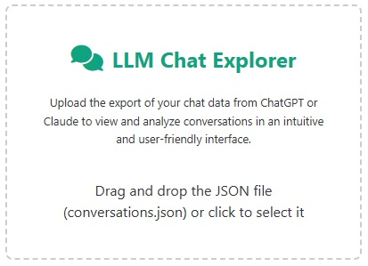
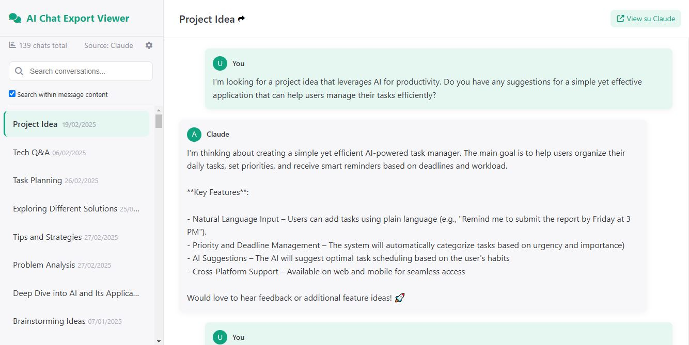
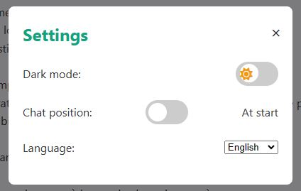
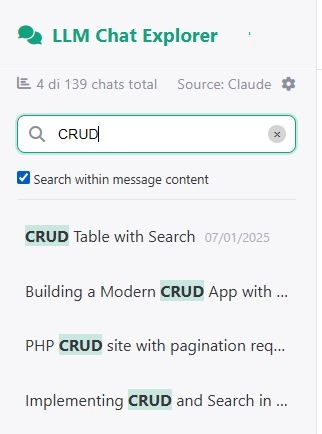

# LLM Chat Explorer
Un'applicazione web incentrata sulla privacy per elaborare e analizzare localmente le esportazioni delle chat di ChatGPT e Claude. Le funzioni di ricerca offerte dalle piattaforme ufficiali sono spesso lente e poco pratiche per chi ha molte conversazioni. Questa applicazione permette di gestire in modo più efficiente il proprio archivio di interazioni con l'AI, garantendo un accesso rapido e ordinato alle chat salvate.

 [](https://github.com/levysoft/llm-chat-explorer/releases) [](https://opensource.org/licenses/GPLv3) [](https://github.com/levysoft/llm-chat-explorer/graphs/commit-activity) [](https://github.com/levysoft/llm-chat-explorer/graphs/contributors) [](https://developer.mozilla.org/en-US/docs/Web/HTML) [](https://developer.mozilla.org/en-US/docs/Web/CSS) [](https://developer.mozilla.org/en-US/docs/Web/JavaScript)

[ [English](README.md) | [Italiano](README.it.md) ]

Questa repository fornisce un'applicazione web per visualizzare ed analizzare le esportazioni delle chat da ChatGPT e Claude, con un forte focus sulla privacy. Tutti i dati vengono elaborati localmente nel browser, garantendo che le informazioni personali non vengano inviate a server esterni. Se desideri, puoi scaricare la pagina HTML per ispezionare il codice sorgente e verificare personalmente il funzionamento dell'applicazione. L'intero progetto è stato sviluppato per essere completamente standalone, utilizzando solo HTML, CSS e JavaScript, senza dipendenze esterne (eccetto i font). Questo permette agli utenti di scaricare e utilizzare la pagina localmente senza necessità di configurazioni aggiuntive.

Sebbene ChatGPT e Claude offrano una funzione di ricerca interna, questa può risultare lenta e macchinosa, soprattutto quando si hanno molte conversazioni salvate. Scaricando il backup delle chat e utilizzando questa applicazione, gli utenti possono gestire in modo più rapido e pratico il proprio archivio di interazioni con l'AI. Questo approccio permette di mantenere un accesso ordinato e veloce alle proprie conversazioni passate, migliorando l'efficienza nella consultazione di informazioni e nella ripresa di discussioni precedenti. Inoltre, lavorare in locale consente di aggirare eventuali limitazioni imposte dalle piattaforme, come la perdita di vecchie chat o la difficoltà di esportare interi archivi di conversazioni.

## Esportazione delle chat da ChatGPT e Claude

Per utilizzare questa applicazione, è necessario prima esportare le conversazioni da ChatGPT o da Claude. Le procedure ufficiali sono disponibili ai seguenti link:

- **ChatGPT**: [Come esportare la cronologia di ChatGPT](https://help.openai.com/en/articles/7260999-how-do-i-export-my-chatgpt-history-and-data)
- **Claude**: [Come esportare la cronologia di Claude](https://support.anthropic.com/en/articles/9450526-how-can-i-export-my-claude-ai-data)

## Contenuti

1. [Introduzione](#introduzione)
2. [Privacy e sicurezza](#privacy-e-sicurezza)
3. [Requisiti](#requisiti)
4. [Installazione](#installazione)
5. [Utilizzo](#utilizzo)
6. [Descrizione dell'applicazione](#descrizione-dellapplicazione)
7. [Struttura dei file](#struttura-dei-file)
8. [Screenshot](#screenshot)
9. [Feedback e contributi](#feedback-e-contributi)
10. [Changelog](#changelog)
11. [Autore](#autore)
12. [Licenza](#licenza)

## Introduzione

**LLM Chat Explorer** è un'applicazione web che consente di caricare ed analizzare file JSON contenenti le conversazioni esportate da ChatGPT e Claude. L'interfaccia intuitiva permette di cercare e visualizzare facilmente le chat, offrendo una soluzione leggera e veloce senza compromettere la privacy dei dati.

Uno dei principali vantaggi di questa applicazione è la possibilità di analizzare facilmente le proprie conversazioni con l'AI senza dover decifrare file JSON grezzi. Mentre ChatGPT fornisce, oltre al file JSON, anche un file HTML preformattato con tutte le chat già integrate, Claude, invece, offre esclusivamente un file JSON, rendendo la consultazione particolarmente difficile, soprattutto se il file è molto grande. **LLM Chat Explorer** risolve questo problema permettendo di visualizzare e navigare agevolmente tra le conversazioni in un'interfaccia intuitiva e accessibile.

## Privacy e sicurezza

L'applicazione è stata progettata con la massima attenzione alla privacy:
- **Elaborazione locale**: Tutti i dati vengono elaborati direttamente nel browser, senza invio a server esterni.
- **Nessun tracciamento**: I dati personali e la cronologia delle chat rimangono completamente sul dispositivo dell'utente.
- **Analisi del codice**: Se desideri approfondire o verificare il funzionamento, puoi scaricare la pagina HTML e analizzare il codice sorgente.
- **Standalone**: L'intera applicazione è realizzata in semplice HTML, CSS e JavaScript, senza dipendenze esterne (ad eccezione di Font Awesome), proprio per permettere di scaricare e utilizzare la pagina HTML localmente senza alcuna configurazione aggiuntiva.
- **Open Source**: Il progetto è rilasciato sotto licenza GPL v3, garantendo trasparenza e possibilità di verifica e miglioramento del codice da parte della community.

## Requisiti

- Browser web moderno (Chrome, Firefox, Edge, Safari)
- Connessione Internet necessaria solo per caricare il file esterno Font Awesome (opzionale, per l'utilizzo offline è necessario scaricare il file CSS corrispondente).

## Installazione

1. Clona la repository:
    ```sh
    git clone https://github.com/levysoft/llm-chat-explorer.git
    ```
2. Apri il file `llm-chat-explorer.html` nel tuo browser preferito.
3. *(Opzionale)* Per un utilizzo completamente offline, è sufficiente scaricare il file CSS di Font Awesome per eliminare ogni dipendenza da asset esterni.

## Utilizzo

1. Avvia l'applicazione aprendo il file `llm-chat-explorer.html` nel browser.
2. Trascina il file JSON (ad esempio, `conversations.json`) nell'area di upload oppure clicca per selezionarlo.
3. Visualizza l'elenco delle chat e seleziona quella che vuoi analizzare.
4. Usa la barra di ricerca per filtrare le conversazioni per titolo o contenuto.
5. Personalizza l'interfaccia modificando lingua, modalità dark e posizione dello scroll attraverso le impostazioni.

## Descrizione dell'applicazione

L'applicazione è sviluppata con HTML, CSS e JavaScript e offre le seguenti funzionalità:
- **Caricamento locale del file JSON**: I dati vengono letti e processati tramite l'oggetto `FileReader` senza essere inviati online.
- **Gestione delle conversazioni**: Supporta i formati di esportazione di ChatGPT e Claude, normalizzando l'ordine delle chat e permettendo la ricerca avanzata sia nei titoli delle chat che nei contenuti.
- **Interfaccia dinamica e responsive**: Una sidebar per navigare tra le chat e un'area di visualizzazione per i messaggi, con supporto alla ricerca e alla personalizzazione.
- **Modalità multilingua e dark/light**: L'interfaccia supporta diverse lingue (Inglese, Italiano, Spagnolo, Francese, Tedesco, Polacco, Cinese, Coreano e Giapponese) e consente di attivare o disattivare la modalità dark dalle impostazioni.    
- **Posizione Chat**: permette di impostare l’ordine dei messaggi all’interno della singola chat.Selezionando “Alla fine” il messaggio più recente apparirà in basso, come nelle comuni app di messaggistica; scegliendo invece “All’inizio”, i messaggi più recenti saranno visualizzati in alto.
- **Visualizzazione diretta delle chat**: Ogni singola chat presente nel backup può essere visualizzata direttamente nel proprio account ChatGPT o Claude cliccando sul link di condivisione associato.

## Struttura dei file
```
llm-chat-explorer/
├── llm-chat-explorer.html      # Pagina principale dell'applicazione
├── assets/                     # Cartella contenente immagini e screenshot
│   ├── screenshot1.jpg
│   ├── screenshot2.jpg
│   ├── screenshot3.jpg
│   └── screenshot4.jpg
├── README.md                   # Questo file
└── LICENSE                     # File di licenza (GPL v3)
```

## Screenshot

Ecco alcuni screenshot dell'applicazione:

- **Pagina di upload**:

  
- **Elenco delle chat**:

  

- **Impostazioni**:

  

- **Ricerca avanzata**:

  

## Feedback e contributi

Il tuo feedback è prezioso! Se riscontri problemi o hai suggerimenti, apri un [issue](https://github.com/levysoft/llm-chat-explorer/issues) o invia una pull request. Contributi e proposte di miglioramento sono sempre benvenuti.

## Changelog

Tutte le modifiche e gli aggiornamenti dell'applicazione sono documentati nel file [CHANGELOG.md](./CHANGELOG.md).

## Autore

Antonio Troise

## Licenza

Questo progetto è rilasciato sotto la licenza [GNU GPL v3](https://www.gnu.org/licenses/gpl-3.0.en.html). Vedi il file LICENSE per maggiori dettagli.

